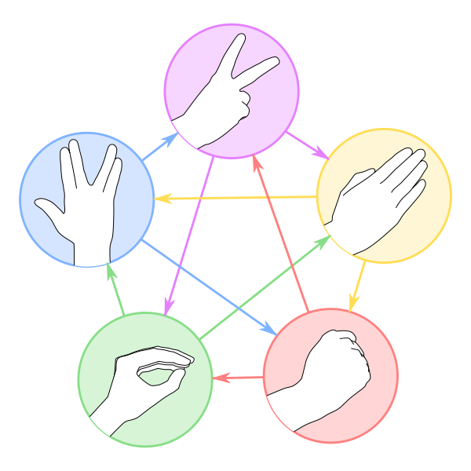

# Rock, Paper, Scissors, Lizard & Spock



It's the eternal battle between Rock, Paper, Scissors, Lizard & Spock. Written in JavaScript with some HTML & CSS in one index.html. Feel free to reuse the code and create your own version.

[Rock, Paper, Scissors, Lizard, Spock.webm](https://github.com/kartikp36/stone-paper-scissors-lizard-spock/assets/36930635/5b42786b-e1ab-4cc0-8852-7f16e2cafe55)

## Development

Run:

```sh
npx serve
```

Open up the link and you're ready to start.

## Credits

- built upon [pong-wars](https://pong-wars.koenvangilst.nl/), original repo: https://github.com/vnglst/pong-wars

## Links

- Original post on Mastodon: https://hachyderm.io/@vnglst/111828811496422610
- On Twitter: https://twitter.com/vnglst/status/1751278052154179770

## Alternate version

If you've created an alternate version of Pong Wars and would like to share it, please feel free to create a pull request to add the link here.

The alternate versions are listed below in alphabetical order:

- [ASCII Python](https://github.com/flash1293/ascii-pong-wars)
- [Atari 2600](https://forums.atariage.com/topic/360475-pong-wars-atari-2600)
- [BBC Micro Bot](https://mastodon.me.uk/@bbcmicrobot/111829277042377169)
- [C version](https://github.com/BrunoLevy/TinyPrograms)
- [C# (Cross-platform on iOS, Android, WebAssembly, MacOS, Linux, and Windows)](https://aka.platform.uno/pongwars)
- [C# with DIKUArcade](https://github.com/Roar-Morkore-Hansen/pong-wars.git)
- [C++](https://invent.kde.org/carlschwan/pongwars/-/blob/master/src/scene.cpp?ref_type=heads)
- [C++ with SFML](https://github.com/Alan-Kuan/pong-wars)
- [Earlier version with padels](https://twitter.com/CasualEffects/status/1390290306206216196)
- [Eternal Bounce Battle (GDevelop)](https://gd.games/victrisgames/eternal-bounce-battle)
- [Flutter](https://github.com/flikkr/flutter_pong_wars)
- [Godot](https://github.com/rosskarchner/pong-wars-godot)
- [Gold Wars (This version has an end!)](https://ask5.github.io/gold-wars/)
- [Java](https://github.com/krefikk/yingyang)
- [Kotlin/Wasm](https://github.com/wasmhub-dev/pong_wars.kt)
- [Land-Or-Water](https://github.com/makaveli2P/land-or-water)
- [Pico8](https://www.pico-8-edu.com/?c=AHB4YQHaAT3vsH558QbF5cXZxd3F_Uedc010zTVJ_gCnN3F6-RNE_SuEUXRRUa8tpK9wzE3nZMedcvntx9y1MpRnV4Xp0v3ZTrm0EUzMSQTsOWBuJL5-8C2Cl0gG0vK2sXTtKYyQN81iujMXPUN03Vq0FGXNajPzGtHOXUGgE3zegFI4hIIzoYCyC7ITgzcogmTuIaba7Nqzz48mh5JFxYFgKllpExWB7ZVnKAaH5qvd3SzqTLA0aZrR1Wy0GFywwsjUQhgOznQ3jtx6QCkisOCWvA9ngqFsZXMnFyKJhkynGFYEyZmCBcaIkk5BMF3YVRBX7RcFcZtGQbRQEN9GU_uMVEkSiRNn_aR55AmGqmBbiigfGuqybCXz5QnZI3W_Lutw2Ph4FOMn6Scn0lBgoSsFi3KlgIGpya1iYRY=&g=w-w-w-w1HQHw-w2Xw-w3Xw-w2HQH)
- [Pong-Wars Fireballs](https://pong-wars-fireballs.vercel.app)
- [Processing](https://github.com/riktov/processing-pong-wars)
- [Pygame version](https://github.com/BjoernSchilberg/py-pong-wars)
- [Python](https://github.com/vocdex/pong-wars-python)
- [Rock, Paper, Scissors, Lizard & Spock](https://kartikp36.github.io/rock-paper-scissors-lizard-spock/)
- [React Native](https://github.com/Nodonisko/react-native-skia-pong-wars)
- [Rust/Wasm](https://github.com/wasmhub-dev/pong_wars.rs)
- [Scratch](https://scratch.mit.edu/projects/957461584)
- [Seasons Pong](https://github.com/hmak-dev/seasons-pong)
- [Swift (SpriteKit)](https://github.com/frederik-jacques/ios-pongwars)
- [Tag-Team](https://github.com/SSteve/pong-wars) ([Live](https://ssteve.github.io/pong-wars/))
- [Yin-Yang Pong](https://ying-yang-pong.vercel.app/)
- [Ying Yang](https://twitter.com/a__islam/status/1751485227787034863)
- [M5Stack version](https://github.com/anoken/pong-wars-forM5Stack/)
- [Hex version](https://pong-wars-hex.whichoneiwonder.com/)
